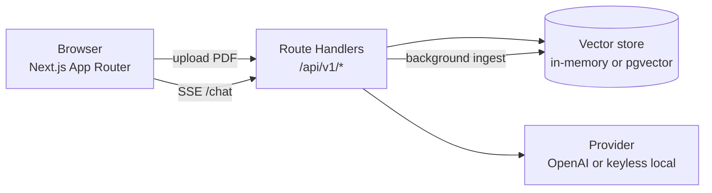

<h1 align="center">FinDocs AI</h1>

<p align="center">
  <b>Chat with financial documents.</b> Upload 10-Ks or policy PDFs and ask
  questions answered <i>only</i> from the source text — streamed token-by-token,
  with inline citations you can click to verify against the exact passage.
</p>

<p align="center">
  
  
  
  
  
</p>

<p align="center">
  <b>Live demo:</b> <i>add your Vercel URL here after deploying</i> ·
  <b>Screenshot/GIF:</b> <code>docs/screenshot.png</code>
</p>

> **Runs with no API key.** A keyless "local mode" powers an always-on, free
> demo. Set `OPENAI_API_KEY` and it upgrades in place to real embeddings and a
> grounded, streamed `gpt-4o-mini` answer.

```
Load samples ─▶ ask a question ─▶ streamed answer with [1][2] chips ─▶
click a citation ─▶ read the exact source passage, document, and page.
```

---

## Why it exists

Analysts and compliance staff read long filings to answer narrow questions
("What was total revenue in FY2024?", "What's the out-of-network deductible?").
Ctrl-F fails when wording differs; a raw LLM invents numbers. **FinDocs AI
grounds every answer in retrieved passages and makes each claim verifiable.**

## Features

- 📄 **PDF ingestion** — drag-drop upload, validated by magic bytes (not
  extension), page-aware text extraction, live parsing → chunking → embedding status.
- ✂️ **Sentence-aware chunking** — ~800 tokens, 15% overlap, never splits
  mid-sentence; each chunk keeps its page range and char span.
- 🔍 **Hybrid retrieval** — dense vector (cosine) **+** BM25, fused with
  Reciprocal Rank Fusion, optionally MMR-diversified.
- 💬 **Grounded streaming answers** — SSE token-by-token, cite-every-sentence,
  refuses when the answer isn't in the documents.
- 🔗 **Verifiable citations** — every `[n]` is checked against a retrieved
  passage; click a chip to read the exact source; a coverage score shows how
  grounded the answer is.
- 🧩 **Swappable everything** — OpenAI **or** keyless local provider; pgvector
  **or** in-memory store — behind clean interfaces.
- 🛡️ **Demo-safe** — per-IP rate limits, a hard daily spend cap, 24h purge.
- 🧪 **Real evals** — retrieval hit@k/MRR, a hybrid-vs-vector A/B, numeric
  exact-match, refusal accuracy, citation coverage.

## Architecture



Everything is **one Next.js app** (one Vercel deploy). Route handlers are the
API; the RAG primitives live in `src/lib/*` as framework-agnostic, unit-tested
modules. Full write-up in [`docs/ARCHITECTURE.md`](docs/ARCHITECTURE.md).

**What happens when you ask a question**

1. `POST /api/v1/chat {question}` — rate-limited, zod-validated.
2. Load prior turns as history.
3. Embed the question with the active provider.
4. **Hybrid retrieval:** vector cosine + BM25 → Reciprocal Rank Fusion → optional MMR.
5. Build a grounded prompt (numbered context, cite-every-sentence, refusal rule).
6. Stream the answer over SSE (`token` / `citations` / `usage` / `done` / `error`).
7. Verify citations (strip dangling `[n]`, compute coverage), persist the turn.

## Tech stack

| Layer            | Choice                                   | Why |
| ---------------- | ---------------------------------------- | --- |
| Framework        | Next.js 15 (App Router) + TS (strict)    | One deployable unit; route handlers = the API |
| Styling          | Tailwind CSS                             | Small, themeable (light/dark), no heavy kit |
| LLM / embeddings | OpenAI `gpt-4o-mini` + `text-embedding-3-small`, behind a `Provider` interface | Cheap, good; swappable — keyless local adapter for the free demo |
| Vector search    | pgvector (HNSW, cosine) or in-memory     | pgvector = the real thing; in-memory = zero-setup demo/tests |
| Lexical search   | BM25 (in-memory) / `ts_rank` (Postgres)  | Catches exact figures/terms embeddings miss |
| PDF              | `unpdf` (serverless pdf.js)              | Per-page extraction that runs on Vercel |
| Tokenizer        | `gpt-tokenizer`                          | Pure-JS token counts for chunk sizing |
| Tests / CI       | Vitest + Testing Library · GitHub Actions | lint → typecheck → test → build |
| Deploy           | Vercel                                   | Free, single deploy, native Next.js |

## Quick start

```bash
git clone https://github.com/saikrishnapachala/findocs-ai.git
cd findocs-ai
npm install
npm run dev        # http://localhost:3000 → "Try with sample documents"
```

That's it — no configuration needed; it runs keyless. To enable real AI, copy
`.env.example` to `.env.local` and set values (all documented there):

- `OPENAI_API_KEY` — real embeddings + generation (otherwise local mode).
- `VECTOR_STORE=pgvector` + `DATABASE_URL` — persist vectors in Postgres/pgvector (e.g. a free Neon database).
- `MAX_DAILY_USD`, `RATE_LIMIT_*` — cost/abuse guardrails.
- `CHUNK_TOKENS`, `CHUNK_OVERLAP`, `RETRIEVAL_K`, `HYBRID_RETRIEVAL`, `MMR_ENABLED` — retrieval tuning.

> 🔒 Secrets never touch git: `.env*` is gitignored; only `.env.example` (empty
> placeholders) is committed.

## Tests & evals

```bash
npm test                                                    # 46 unit/integration tests
npm run query -- "What was total revenue in fiscal 2024?"   # retrieval CLI
npm run eval                                                # retrieval + answer metrics + hybrid A/B
```

**Latest eval (keyless local mode)** — detail in [`docs/EVALS.md`](docs/EVALS.md):

| Retrieval   | hit@1 |  MRR  | | Answers | value |
| ----------- | :---: | :---: |-| ------- | :---: |
| **hybrid**  | 0.970 | 0.985 | | Numeric exact-match (n=32) | **1.000** |
| vector-only | 0.848 | 0.909 | | Refusal accuracy (n=5) | 0.400 |
|             |       |       | | Avg citation coverage | 0.783 |

Hybrid retrieval lifts hit@1 **0.85 → 0.97** — the BM25 half catching exact
figures and defined terms that dense embeddings rank lower.

## Trade-offs & limitations (honest)

- **Keyless local mode is extractive** — it stitches best-matching sentences and
  refuses only when few query terms match, so it *over-answers* some out-of-scope
  questions (refusal accuracy 0.40). The **OpenAI path refuses correctly**; local
  mode is the free fallback, not the headline experience.
- **In-memory state is per serverless instance.** A typical single-user demo
  keeps one warm instance and just works; for robustness across instances set
  `VECTOR_STORE=pgvector` + `DATABASE_URL` so chunks are shared (metadata/history
  and the rate limiter stay per-instance — see [ADR-005](docs/DECISIONS.md)).
- **No OCR** — scanned PDFs are detected and rejected with a clear message.
- **Fixed-size chunking** — semantic chunking would improve boundaries.
- Ingestion runs in a `next/server` `after()` callback, not a real queue.

## Deploy to Vercel

1. Push this repo to GitHub (done).
2. Import it at [vercel.com/new](https://vercel.com/new) — framework auto-detected.
3. *(Optional)* set `OPENAI_API_KEY` and/or `VECTOR_STORE=pgvector` + `DATABASE_URL`
   in Project → Settings → Environment Variables. With none set, the demo runs
   free in local mode.
4. Deploy, then put the URL at the top of this README.

## What I'd do next

1. Turn on the LLM-as-judge faithfulness/relevance eval with `gpt-4o-mini`.
2. Move all state to Postgres + Redis/Upstash (shared across instances).
3. Real ingestion queue + worker instead of `after()`.
4. Cross-encoder reranker, A/B'd against RRF.
5. Semantic chunking; auth + per-tenant row-level security.

## Docs

- [`docs/ARCHITECTURE.md`](docs/ARCHITECTURE.md) — module map, request lifecycle, streaming, provider abstraction
- [`docs/DECISIONS.md`](docs/DECISIONS.md) — ADR-lite log (why single-app, keyless mode, chunking, hybrid, serverless)
- [`docs/EVALS.md`](docs/EVALS.md) — method, latest numbers, the A/B, honest caveats
- [`docs/INTERVIEW_NOTES.md`](docs/INTERVIEW_NOTES.md) — 10 grounded Q&As about the code

---

Built by **Sai Krishna Pachala** · MIT licensed · uses only well-known, stable
libraries — no magic, every decision documented.
