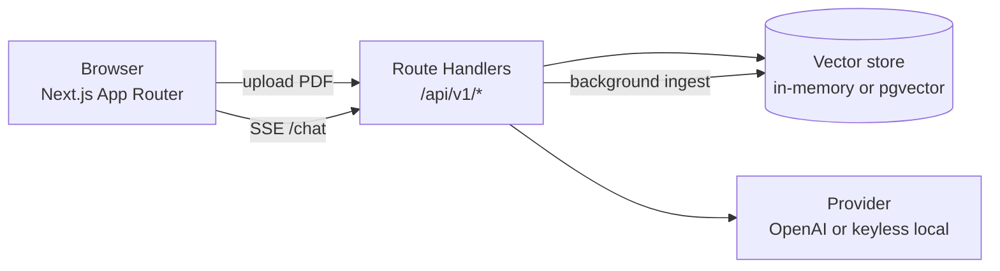

# FinDocs AI — chat with financial documents

Upload financial PDFs (10-Ks, insurance policies) and ask questions answered
**only from the source text**, streamed token-by-token with **inline citations**
you can click to verify against the exact passage.

> **Live demo:** _add your Vercel URL here after deploying_
> _(30-second screenshot/GIF: `docs/screenshot.png`)_

It runs **with no API key** — a keyless "local mode" powers an always-on, free
demo. Set `OPENAI_API_KEY` and it upgrades in place to real embeddings and a
grounded, streamed `gpt-4o-mini` answer.

```
Load samples ─▶ ask a question ─▶ streamed answer with [1][2] chips ─▶ click a
citation ─▶ read the exact source passage, document, and page.
```

## Why it exists

Analysts and compliance staff read long filings to answer narrow questions
("What was total revenue in FY2024?", "What's the out-of-network deductible?").
Ctrl-F fails when wording differs; a raw LLM invents numbers. FinDocs AI grounds
every answer in retrieved passages and makes each claim verifiable.

## Architecture



Everything is **one Next.js app** (one Vercel deploy). Route handlers are the
API; the RAG primitives live in `src/lib/*` as framework-agnostic, unit-tested
modules. See [`docs/ARCHITECTURE.md`](docs/ARCHITECTURE.md).

**What happens when you ask a question**

1. `POST /api/v1/chat {question}` (rate-limited, zod-validated).
2. Load prior turns as history.
3. Embed the question with the active provider.
4. **Hybrid retrieval:** vector cosine + BM25, fused with Reciprocal Rank Fusion,
   optionally MMR-diversified.
5. Build a grounded prompt (numbered context, cite-every-sentence, refusal rule).
6. Stream the answer over SSE (`token`/`citations`/`usage`/`done`/`error`).
7. Verify citations (strip dangling `[n]`, compute coverage), persist the turn.

## Stack

| Layer            | Choice                                   | Why |
| ---------------- | ---------------------------------------- | --- |
| Framework        | Next.js 15 (App Router) + TS (strict)    | One deployable unit; route handlers = the API |
| Styling          | Tailwind CSS                             | Small, themeable (light/dark), no heavy kit |
| LLM / embeddings | OpenAI `gpt-4o-mini` + `text-embedding-3-small`, behind a `Provider` interface | Cheap, good; swappable — keyless local adapter for the free demo |
| Vector search    | pgvector (HNSW, cosine) or in-memory     | pgvector = the real thing; in-memory = zero-setup demo/tests |
| Lexical search   | BM25 (in-memory) / `ts_rank` (Postgres)  | Catches exact figures/terms embeddings miss |
| PDF              | `unpdf` (serverless pdf.js)              | Per-page text extraction that runs on Vercel |
| Tokenizer        | `gpt-tokenizer`                          | Pure-JS token counts for chunk sizing |
| Tests            | Vitest + Testing Library                 | Fast unit + component tests |
| CI               | GitHub Actions                           | lint → typecheck → test → build |
| Deploy           | Vercel                                   | Free, single deploy, native Next.js |

## Trade-offs & limitations (honest)

- **Keyless local mode is extractive** — it stitches the best-matching sentences
  and refuses only when few query terms match, so it *over-answers* some
  out-of-scope questions (eval refusal accuracy 0.40). The **OpenAI path refuses
  correctly**; local mode is the free fallback, not the headline experience.
- **In-memory registry is per serverless instance.** For a typical single-user
  demo Vercel keeps one warm instance and it just works. For robustness across
  instances, set `VECTOR_STORE=pgvector` + `DATABASE_URL` (Neon free tier) so
  chunks are shared; document metadata/history and the rate limiter/spend cap
  remain per-instance (see ADR-005).
- **No OCR** — scanned PDFs are detected and rejected with a clear message.
- **Fixed-size chunking** — semantic chunking would improve boundary quality.
- Ingestion runs in a `next/server` `after()` callback, not a real queue.

## Local setup

```bash
git clone <your-repo-url> && cd findocs-ai
cp .env.example .env.local        # optional — runs keyless with none set
npm install
npm run dev                       # http://localhost:3000 → "Try with sample documents"
```

`.env.local` is entirely optional. Useful keys (all documented in
[`.env.example`](.env.example)):

- `OPENAI_API_KEY` — enables real embeddings + generation (otherwise local mode).
- `VECTOR_STORE=pgvector` + `DATABASE_URL` — persist vectors in Postgres/pgvector.
- `MAX_DAILY_USD`, `RATE_LIMIT_*` — demo cost/abuse guardrails.
- `CHUNK_TOKENS`, `CHUNK_OVERLAP`, `RETRIEVAL_K`, `HYBRID_RETRIEVAL`, `MMR_ENABLED`
  — retrieval tuning.

## Tests & evals

```bash
npm test                          # 46 unit/integration tests
npm run query -- "What was total revenue in fiscal 2024?"   # retrieval CLI
npm run eval                      # retrieval + answer metrics + hybrid A/B
```

**Latest eval (keyless local mode)** — full detail in [`docs/EVALS.md`](docs/EVALS.md):

| Retrieval   | hit@1 | MRR   |            | Answers | value |
| ----------- | :---: | :---: | ---------- | ------- | :---: |
| **hybrid**  | 0.970 | 0.985 |            | Numeric exact-match (n=32) | 1.000 |
| vector-only | 0.848 | 0.909 |            | Refusal accuracy (n=5) | 0.400 |
|             |       |       |            | Avg citation coverage | 0.783 |

Hybrid retrieval lifts hit@1 **0.85 → 0.97** — the BM25 half catching exact
figures and defined terms.

## Deploy (Vercel)

1. Push this repo to GitHub.
2. Import it in Vercel (framework auto-detected as Next.js).
3. (Optional) set `OPENAI_API_KEY` and/or `VECTOR_STORE=pgvector` + `DATABASE_URL`
   in Project → Settings → Environment Variables. With none set, the deployed
   demo runs free in local mode.
4. Deploy, then put the URL at the top of this README.

## What I'd do next

1. Turn on the LLM-as-judge faithfulness/relevance eval with `gpt-4o-mini`.
2. Move all state to Postgres + Redis/Upstash (shared across instances).
3. Real ingestion queue + worker instead of `after()`.
4. Cross-encoder reranker, A/B'd against RRF.
5. Semantic chunking; auth + per-tenant row-level security.

---

Built by **Sai Krishna Pachala**. Uses only well-known, stable libraries — no
magic, every decision is documented in [`docs/`](docs/).
