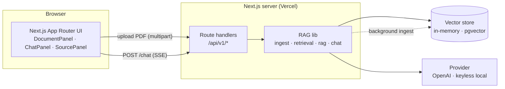
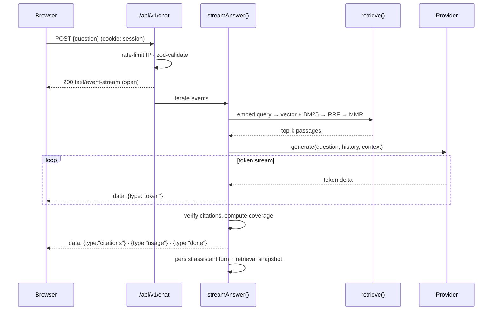
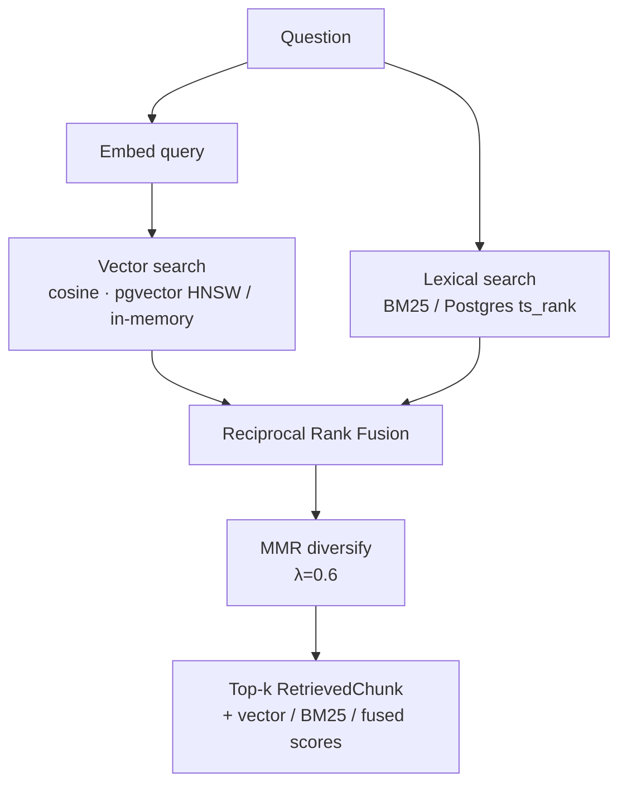
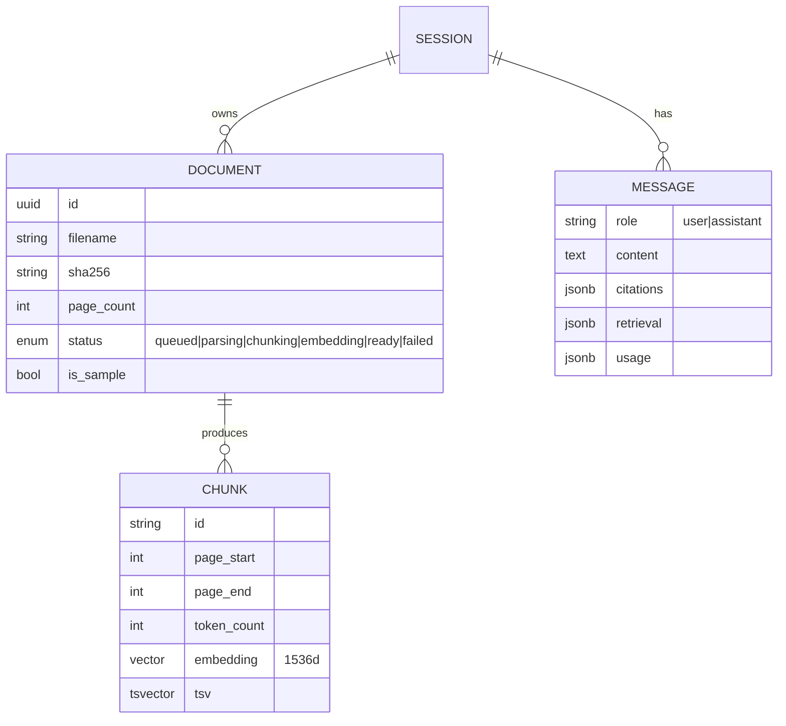

<h1 align="center">FinDocs AI</h1>

<p align="center">
  <b>Chat with financial documents.</b> Upload 10-Ks or policy PDFs and ask
  questions answered <i>only</i> from the source text — streamed token-by-token,
  with inline citations you can click to verify against the exact passage.
</p>

<p align="center">
  
  
  
  
  
</p>

<p align="center">
  <b>Live demo:</b> <i>add your Vercel URL here after deploying</i> ·
  <b>Screenshot/GIF:</b> <code>docs/screenshot.png</code>
</p>

> **Runs with no API key.** A keyless "local mode" powers an always-on, free
> demo. Set `OPENAI_API_KEY` and it upgrades in place to real embeddings and a
> grounded, streamed `gpt-4o-mini` answer.

```
Load samples ─▶ ask a question ─▶ streamed answer with [1][2] chips ─▶
click a citation ─▶ read the exact source passage, document, and page.
```

---

## Table of contents

- [Why it exists](#why-it-exists)
- [Features](#features)
- [Architecture](#architecture)
  - [System overview](#system-overview)
  - [Request lifecycle (chat)](#request-lifecycle-chat)
  - [Retrieval pipeline](#retrieval-pipeline)
  - [Provider abstraction](#provider-abstraction)
  - [Streaming (SSE)](#streaming-sse)
  - [Storage & data model](#storage--data-model)
- [API reference](#api-reference)
- [Project structure](#project-structure)
- [Tech stack](#tech-stack)
- [Quick start](#quick-start)
- [Configuration](#configuration)
- [Tests & evals](#tests--evals)
- [Trade-offs & limitations](#trade-offs--limitations)
- [Deploy to Vercel](#deploy-to-vercel)
- [Roadmap](#roadmap)
- [Further docs](#further-docs)

---

## Why it exists

Analysts and compliance staff read long filings to answer narrow questions
("What was total revenue in FY2024?", "What's the out-of-network deductible?").
Ctrl-F fails when wording differs; a raw LLM invents numbers. **FinDocs AI
grounds every answer in retrieved passages and makes each claim verifiable** —
each sentence is cited to the exact document and page it came from.

## Features

- 📄 **PDF ingestion** — drag-drop upload, validated by magic bytes (not
  extension), page-aware text extraction, live parsing → chunking → embedding status.
- ✂️ **Sentence-aware chunking** — ~800 tokens, 15% overlap, never splits
  mid-sentence; each chunk keeps its page range and character span.
- 🔍 **Hybrid retrieval** — dense vector (cosine) **+** BM25 lexical, fused with
  Reciprocal Rank Fusion, optionally MMR-diversified.
- 💬 **Grounded streaming answers** — SSE token-by-token, cite-every-sentence,
  refuses when the answer isn't in the documents.
- 🔗 **Verifiable citations** — every `[n]` is checked against a retrieved
  passage; click a chip to read the exact source; a coverage score shows how
  grounded the answer is.
- 🧩 **Swappable everything** — OpenAI **or** keyless local provider; pgvector
  **or** in-memory store — behind clean interfaces.
- 🛡️ **Demo-safe** — per-IP rate limits, a hard daily spend cap, 24h purge.
- 🧪 **Real evals** — retrieval hit@k / MRR, a hybrid-vs-vector A/B, numeric
  exact-match, refusal accuracy, citation coverage.
- ♿ **Accessible** — keyboard-navigable chat, `aria-live` streaming region,
  visible focus rings, light/dark themes, mobile tabs.

## Architecture

Everything is **one Next.js 15 app** deployed as a single unit. Route handlers
under `src/app/api/v1/*` are the API; the RAG primitives live in `src/lib/*` as
framework-agnostic, individually unit-tested modules. There is no separate
backend service — see [ADR-001](docs/DECISIONS.md) for why.

### System overview



### Request lifecycle (chat)



1. `POST /api/v1/chat {question}` — rate-limited per IP, body validated with zod.
2. Prior turns are loaded as conversation history.
3. The question is embedded with the active provider.
4. **Hybrid retrieval** (see below) returns the top-k grounded passages.
5. A grounded prompt is built (numbered context, cite-every-sentence, refusal rule).
6. The answer streams back over SSE (`token` / `citations` / `usage` / `done` / `error`).
7. Citations are verified (dangling `[n]` reported, coverage computed); the
   message + retrieval snapshot are persisted to the session.

### Retrieval pipeline



- **Why hybrid:** dense embeddings miss exact tokens (ticker symbols, dollar
  figures, defined terms like "deductible"); BM25 catches them. Paraphrases go
  the other way.
- **Why RRF:** it fuses on *rank*, so the incomparable cosine (~0–1) and BM25
  (unbounded) scales don't need calibration. `k = 60` (Cormack et al.).
- **Why MMR:** greedily trades relevance against redundancy so the k passages
  aren't all from the same page/paragraph.
- Every returned `RetrievedChunk` carries its vector score, BM25 rank, and fused
  score — surfaced in the eval and available to the UI.

`HYBRID_RETRIEVAL=false` disables the lexical half (used for the A/B in the eval).

### Provider abstraction

```ts
interface Provider {
  embed(texts: string[]): Promise<{ vectors: number[][]; usage: Usage }>;
  generate(params): AsyncGenerator<string, Usage>; // yields tokens, returns Usage
}
```

| Provider          | Embeddings                       | Generation                        |
| ----------------- | -------------------------------- | --------------------------------- |
| `OpenAiProvider`  | `text-embedding-3-small` (1536d) | streamed `gpt-4o-mini`, temp 0    |
| `LocalProvider`   | keyless feature-hashing (1536d)  | extractive (stitched top sentences) |

`getProvider()` picks OpenAI when a key is set **and** the daily spend cap
allows, otherwise the local provider — so the demo degrades gracefully instead
of erroring or running up a bill. The same retrieval + citation code path runs
for both, so structure is honest even without a key.

### Streaming (SSE)

`streamAnswer()` is an async generator of typed events; the chat route wraps it
in a `ReadableStream` with `text/event-stream` headers. The browser reads the
body with a `fetch` reader (not `EventSource`, which can't POST), so the client
can **abort mid-stream** — that's the "Stop generating" button, forwarded to the
OpenAI request via `AbortSignal`.

```
event types:  token · citations · usage · done · error
```

### Storage & data model

Two swappable vector stores implement one interface; document/session/message
metadata lives in an in-process registry keyed by an anonymous session cookie.



With `VECTOR_STORE=pgvector`, chunks persist to Postgres with an **HNSW cosine
index** and a generated `tsvector` + GIN index (schema auto-created). In the
default in-memory store, cosine and BM25 are computed in-process — perfect for
the demo and tests. Document metadata and chat history are in-process either way
(a documented serverless caveat — see [ADR-005](docs/DECISIONS.md)).

## API reference

Base path `/api/v1`. All errors use `{ error: { code, message, request_id } }`.
Session is an anonymous `httpOnly` cookie, set/reused automatically.

| Method | Path | Body / params | Response |
| ------ | ---- | ------------- | -------- |
| `POST` | `/sessions` | — | `{ session_id }` (sets cookie) |
| `POST` | `/documents` | multipart `file` | `202 { id, status, … }` (ingest runs in background) |
| `GET`  | `/documents` | — | `[{ id, filename, status, page_count, chunk_count, … }]` |
| `GET`  | `/documents/:id/status` | — | `{ status, progress:{ pages, chunks_done, chunks_total }, error }` |
| `DELETE` | `/documents/:id` | — | `204` (removes chunks + record) |
| `POST` | `/documents/sample` | — | loads the built-in sample docs into the session |
| `POST` | `/chat` | `{ question, document_ids? }` | **SSE stream** — `token` / `citations` / `usage` / `done` / `error` |
| `GET`  | `/messages` | — | `{ messages: [...] }` (session history) |
| `DELETE` | `/messages` | — | `204` (clears history) |
| `GET`  | `/healthz` | — | `{ ok, provider, model, vectorStore }` |

**Guardrails:** 20 chat req/IP/min, 5 uploads/IP/hour, upload ≤ 25 MB / ≤ 300
pages (magic-byte validated), hard `MAX_DAILY_USD` cap, 24h session purge.

## Project structure

```
findocs-ai/
├── src/
│   ├── app/
│   │   ├── api/v1/                 # the API (route handlers)
│   │   │   ├── chat/route.ts       # SSE streaming chat
│   │   │   ├── documents/…         # upload / list / status / delete / sample
│   │   │   ├── messages/route.ts   # history
│   │   │   ├── sessions/route.ts
│   │   │   └── healthz/route.ts
│   │   ├── page.tsx                # client orchestrator (state, streaming, polling)
│   │   ├── layout.tsx · globals.css
│   ├── components/                 # DocumentPanel · ChatPanel · MessageView · SourcePanel
│   └── lib/
│       ├── providers/              # Provider interface + OpenAI + keyless local
│       ├── ingest/                 # pdf · chunker · tokens · hash · service
│       ├── store/                  # vector (memory + pgvector) · scoring · registry
│       ├── retrieval/              # rrf · mmr · retrieve
│       ├── rag/                    # prompt builder · citation verification
│       ├── chat/                   # SSE events · streamAnswer pipeline
│       ├── seed/                   # synthetic sample corpus + seeder
│       ├── config.ts · logger.ts · cost.ts · spend.ts
│       ├── rateLimit.ts · maintenance.ts · session.ts · errors.ts · types.ts
├── scripts/                        # query CLI · eval harness
├── evals/questions.jsonl           # 37-question eval set
├── docs/                           # ARCHITECTURE · DECISIONS · EVALS · INTERVIEW_NOTES
├── .github/workflows/ci.yml        # lint → typecheck → test → build
└── vercel.json · Makefile · .env.example
```

Tests live next to the code they cover (`*.test.ts`): chunker, sentence
splitter, cosine/BM25, RRF, MMR, an end-to-end retrieval test, prompt builder,
citation verification, rate limiter, and spend cap.

## Tech stack

| Layer            | Choice                                   | Why |
| ---------------- | ---------------------------------------- | --- |
| Framework        | Next.js 15 (App Router) + TS (strict)    | One deployable unit; route handlers = the API |
| Styling          | Tailwind CSS                             | Small, themeable (light/dark), no heavy kit |
| LLM / embeddings | OpenAI `gpt-4o-mini` + `text-embedding-3-small`, behind a `Provider` interface | Cheap, good; swappable — keyless local adapter for the free demo |
| Vector search    | pgvector (HNSW, cosine) or in-memory     | pgvector = the real thing; in-memory = zero-setup demo/tests |
| Lexical search   | BM25 (in-memory) / `ts_rank` (Postgres)  | Catches exact figures/terms embeddings miss |
| PDF              | `unpdf` (serverless pdf.js)              | Per-page extraction that runs on Vercel |
| Tokenizer        | `gpt-tokenizer`                          | Pure-JS token counts for chunk sizing |
| Markdown         | `react-markdown` + `remark-gfm`          | Safe rendering with custom citation-chip injection |
| Tests / CI       | Vitest + Testing Library · GitHub Actions | lint → typecheck → test → build |
| Deploy           | Vercel                                   | Free, single deploy, native Next.js |

## Quick start

```bash
git clone https://github.com/saikrishnapachala/findocs-ai.git
cd findocs-ai
npm install
npm run dev        # http://localhost:3000 → "Try with sample documents"
```

No configuration needed — it runs keyless. `make dev/test/eval/query` wrap the
npm scripts.

## Configuration

Everything is optional; the app runs with an empty environment. Copy
`.env.example` → `.env.local` to change any of it. **Secrets never touch git:**
`.env*` is gitignored; only `.env.example` (empty placeholders) is committed.

| Variable | Default | Purpose |
| -------- | ------- | ------- |
| `OPENAI_API_KEY` | *(empty)* | Enables real embeddings + generation; blank ⇒ keyless local mode |
| `LLM_PROVIDER` | `auto` | `auto` / `openai` / `local` |
| `CHAT_MODEL` | `gpt-4o-mini` | Chat model |
| `EMBEDDING_MODEL` | `text-embedding-3-small` | Embedding model |
| `VECTOR_STORE` | `memory` | `memory` or `pgvector` |
| `DATABASE_URL` | *(empty)* | Postgres/pgvector URL (Neon, Supabase, local) when `pgvector` |
| `CHUNK_TOKENS` | `800` | Target chunk size (tokens) |
| `CHUNK_OVERLAP` | `0.15` | Overlap fraction |
| `RETRIEVAL_K` | `8` | Passages returned |
| `HYBRID_RETRIEVAL` | `true` | Vector + BM25 (`false` = vector only) |
| `MMR_ENABLED` | `true` | Diversify results |
| `MAX_DAILY_USD` | `2.00` | Hard daily spend cap → falls back to local mode |
| `RATE_LIMIT_CHAT_PER_MIN` | `20` | Per-IP chat limit |
| `RATE_LIMIT_UPLOAD_PER_HOUR` | `5` | Per-IP upload limit |
| `MAX_UPLOAD_MB` / `MAX_PDF_PAGES` | `25` / `300` | Upload guardrails |

## Tests & evals

```bash
npm test                                                    # 46 unit/integration tests
npm run query -- "What was total revenue in fiscal 2024?"   # retrieval CLI
npm run eval                                                # retrieval + answer metrics + hybrid A/B
```

**Latest eval (keyless local mode)** — detail in [`docs/EVALS.md`](docs/EVALS.md):

| Retrieval   | hit@1 |  MRR  | | Answers | value |
| ----------- | :---: | :---: |-| ------- | :---: |
| **hybrid**  | 0.970 | 0.985 | | Numeric exact-match (n=32) | **1.000** |
| vector-only | 0.848 | 0.909 | | Refusal accuracy (n=5) | 0.400 |
|             |       |       | | Avg citation coverage | 0.783 |

Hybrid retrieval lifts hit@1 **0.85 → 0.97** — the BM25 half catching exact
figures and defined terms that dense embeddings rank lower.

## Trade-offs & limitations

Honest, and documented in [`docs/DECISIONS.md`](docs/DECISIONS.md):

- **Keyless local mode is extractive** — it stitches best-matching sentences and
  refuses only when few query terms match, so it *over-answers* some out-of-scope
  questions (refusal accuracy 0.40). The **OpenAI path refuses correctly** via the
  grounded prompt; local mode is the free fallback, not the headline experience.
- **In-memory state is per serverless instance.** A single-user demo keeps one
  warm instance and just works; for robustness across instances set
  `VECTOR_STORE=pgvector` + `DATABASE_URL` so chunks are shared (metadata/history
  and the rate limiter stay per-instance).
- **No OCR** — scanned PDFs are detected and rejected with a clear message.
- **Fixed-size chunking** — semantic chunking would improve boundaries.
- **Ingestion** runs in a `next/server` `after()` callback, not a real queue.

## Deploy to Vercel

1. Push to GitHub (done).
2. Import the repo at [vercel.com/new](https://vercel.com/new) — framework
   auto-detected as Next.js.
3. *(Optional)* set `OPENAI_API_KEY` and/or `VECTOR_STORE=pgvector` +
   `DATABASE_URL` in Project → Settings → Environment Variables. With none set,
   the demo runs free in local mode.
4. Deploy, then put the URL at the top of this README.

CLI alternative: `npx vercel login` then `npx vercel --prod --yes` from the
project folder.

## Roadmap

1. Turn on the LLM-as-judge faithfulness/relevance eval with `gpt-4o-mini`.
2. Move all state to Postgres + Redis/Upstash (shared across instances).
3. Real ingestion queue + worker instead of `after()`.
4. Cross-encoder reranker, A/B'd against RRF.
5. Semantic chunking; auth + per-tenant row-level security.

## Further docs

- [`docs/ARCHITECTURE.md`](docs/ARCHITECTURE.md) — module map, request lifecycle, streaming, provider abstraction
- [`docs/DECISIONS.md`](docs/DECISIONS.md) — ADR-lite log (single-app, keyless mode, chunking, hybrid, serverless)
- [`docs/EVALS.md`](docs/EVALS.md) — method, latest numbers, the A/B, honest caveats
- [`docs/INTERVIEW_NOTES.md`](docs/INTERVIEW_NOTES.md) — 10 grounded Q&As about the code

---

Built by **Sai Krishna Pachala** · MIT licensed · uses only well-known, stable
libraries — no magic, every decision documented.
