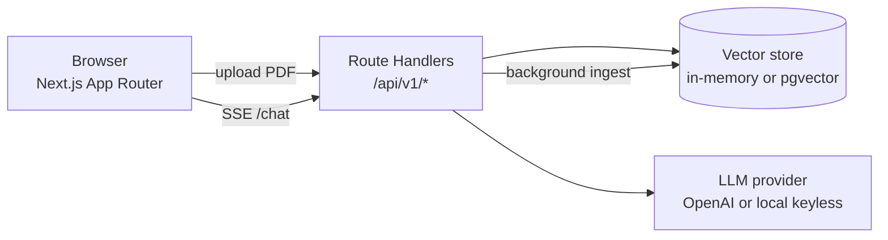

# Architecture — FinDocs AI

> Populated incrementally as milestones land. See `DECISIONS.md` for the "why"
> behind each choice.

## System overview



Everything runs inside a single Next.js deployment. Route handlers under
`src/app/api/v1/*` play the role the PRD assigned to a standalone FastAPI
service; the RAG primitives (chunking, embeddings, hybrid retrieval, streaming
generation, citation verification) live in `src/lib/*` as framework-agnostic
modules so they can be unit-tested without HTTP.

## Request lifecycle (chat)

1. Browser POSTs `{ question, documentIds? }` to `/api/v1/chat` with the session cookie.
2. Handler loads recent history for the session.
3. The question is embedded with the active provider.
4. Hybrid retrieval: vector cosine top-k + keyword search fused with Reciprocal Rank Fusion, optionally MMR-diversified.
5. A grounded prompt is built (numbered context, citation + refusal rules).
6. The completion is streamed back token-by-token over SSE.
7. Citations are post-processed (dangling `[n]` stripped, coverage computed); the message + retrieval snapshot are persisted for the session.

## Module map

```
src/lib/
  config.ts            env -> typed config (safe defaults; runs with empty env)
  providers/           Provider interface + OpenAI and keyless-local adapters
  ingest/              pdf extraction, sentence-aware chunker, ingest service
  store/               VectorStore (memory + pgvector), scoring (cosine, BM25),
                       document/message registry
  retrieval/           RRF fusion, MMR, retrieve() orchestrator
  rag/                 grounded prompt builder, citation post-processing
  chat/                SSE event types + streamAnswer() pipeline
  seed/                synthetic sample corpus + seeder
  rateLimit.ts spend.ts maintenance.ts   demo safety rails
src/app/api/v1/        route handlers (the "API")
src/components/        DocumentPanel, ChatPanel, MessageView, SourcePanel
```

Each `src/lib/*` module is framework-agnostic and unit-tested without HTTP;
route handlers are thin adapters over them.

## Retrieval detail

1. Embed the query with the active provider.
2. Pull a candidate pool (≈3× k) from **vector** search (cosine, pgvector HNSW
   or in-memory) and **lexical** search (BM25 in-memory / `ts_rank` in Postgres).
3. Fuse the two ranked lists with **Reciprocal Rank Fusion** (rank-based, so the
   incomparable cosine and BM25 scales don't need calibration).
4. Optionally diversify with **MMR** (λ=0.6) so passages aren't all from one page.
5. Return top-k `RetrievedChunk`, each carrying its vector score, BM25 rank, and
   fused score for eval + the UI.

## Streaming

`streamAnswer()` is an async generator of typed events (`token`, `citations`,
`usage`, `done`, `error`). The chat route wraps it in a `ReadableStream` and
sets SSE headers; the browser reads the body with a `fetch` reader (not
`EventSource`, which can't POST) so the client can abort mid-stream — that is the
"Stop generating" button, propagated to the OpenAI request via `AbortSignal`.

## Provider abstraction

```
Provider
  embed(texts)               -> { vectors, usage }
  generate(params)           -> async generator yielding tokens, returning Usage
OpenAiProvider   real embeddings + streamed chat (temperature 0)
LocalProvider    keyless feature-hashing embeddings + extractive answers
```

`getProvider()` picks OpenAI when a key is set and the daily spend cap allows,
otherwise the local provider — so the demo degrades gracefully instead of
erroring or billing.
