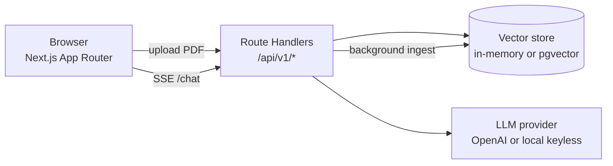

# Architecture — FinDocs AI

> Populated incrementally as milestones land. See `DECISIONS.md` for the "why"
> behind each choice.

## System overview

Everything runs inside a single Next.js deployment. Route handlers under
`src/app/api/v1/*` play the role the PRD assigned to a standalone FastAPI
service; the RAG primitives (chunking, embeddings, hybrid retrieval, streaming
generation, citation verification) live in `src/lib/*` as framework-agnostic
modules so they can be unit-tested without HTTP.

## Request lifecycle (chat)

1. Browser POSTs `{ question, documentIds? }` to `/api/v1/chat` with the session cookie.
2. Handler loads recent history for the session.
3. The question is embedded with the active provider.
4. Hybrid retrieval: vector cosine top-k + keyword search fused with Reciprocal Rank Fusion, optionally MMR-diversified.
5. A grounded prompt is built (numbered context, citation + refusal rules).
6. The completion is streamed back token-by-token over SSE.
7. Citations are post-processed (dangling `[n]` stripped, coverage computed); the message + retrieval snapshot are persisted for the session.

_Details filled in per milestone._
